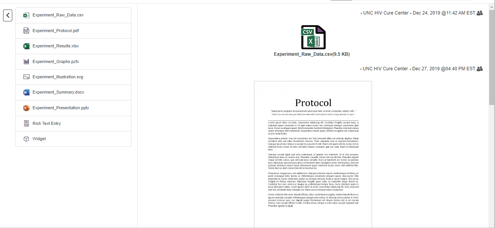

# LabArchives Entry List

This extension adds a navigation menu on the left-hand side of an entry page in a notebook on LabArchives.com.  

The entry menu displays a list of all the entries on the page indicating type of file or type of entry.  Clicking on a an item will scroll to that place on the page.

The menu is also collapsible.

This extension works in both Chrome and Firefox.

## Versions

0.2.0
***
- Made the menu collapsible.  
- Fixed the menu/entry page heights so as not to hide the footer.
- Menu reorders when page entries are reordered.
- Menu is updated when entries are added or deleted.

0.1.0
***
Initial Release

## Disclaimer
This extension is not developed by or affiliated with LabArchives.

## License
This extension is owned by the UNC HIV Cure Center and is free for personal use only.

## Credit
The notebook icon used for this extension is based on the [Background vector created by invisible_studio - www.freepik.com](https://www.freepik.com/free-photos-vectors/background).